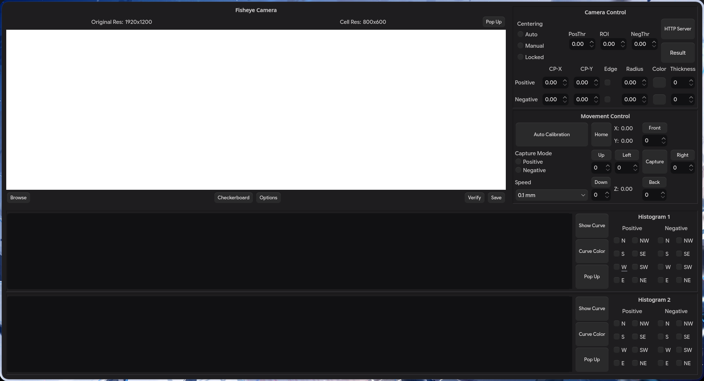

# Fisheye-Calibrator

> ![INFO]
> Still in Development

Frontend side of the controller

## Preview



(Using darkly theme)

## Running

```
python -m venv .venv
pip install -r requirements.txt

python src/main.py
```
